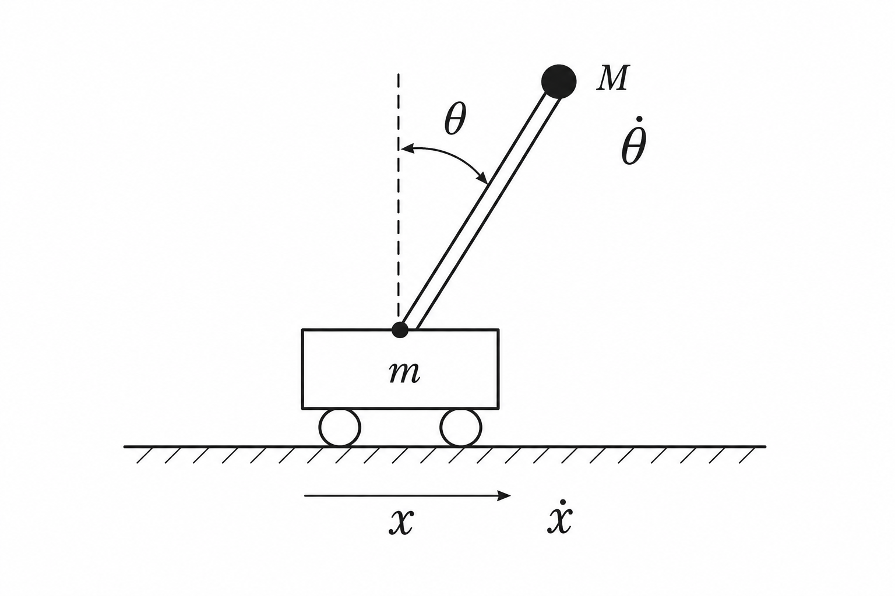

# mdp-cart-pole

The “Cart-Pole” problem is a classic dynamical system of study. It is deceptively simple and has been well-examined for over a hundred years. The first written description of the problem can be traced to Stephenson (1908) [0] with a surge in study within formal academic settings emerging in the 1960s [1][2][3]

<p align="center">
  
  <br>
  <sub>Fig. Classic annotated diagram of the cart-pole system under study</sub>
</p>

The cart-pole problem can be formulated as a Markov decision process (MDP) with the following states and actions:

- **State $s = (x, \dot x, \theta, \dot\theta) \in \mathcal S \subset \mathbb{R}^4$**:
  - $x$ : cart position (in meters `m` offset from `0` center, left offset is negative and right is positive)
  - $\dot x$ : velocity (`m/s`), i.e. first derivative of $x$ with respect to time
  - $\theta$ : pole angle (radians) from vertical
  - $\dot\theta$ : angular velocity (`rad/sec`) or first derivative of $\theta$
- **Action $a \in \mathcal A \subset \mathbb{R}$**: force applied to the cart in Newtons (`N`), to the left is a negative force, and to the right is positive force

This [`mdp-cart-pole/`](README.md) repo subfolder implements solutions spanning two school-of-thought lineages:

- [`rl/`](rl) : Reinforcement Learning
- [`oc/`](oc) : Optimal Control

These fields have recently converged in recognizing that model-predictive control (MPC) from the optimal control theory school is roughly equivalent to model-based reinforcement learning (MBRL) in the latter.

I explore the cart-pole problem to understand the various implementations of solving this MDP over the last few decades to gain better insights into optimal control and RL.

## Tests

This directory tree contains Python implementations of various solutions to the cart-pole problem and is configured with `pytest`. These can be run with

```sh
pytest            # tests everything, takes roughly 6 mins in total
pytest -m fast    # tests a sample of important test cases, finishes in ~5 secs
pytest -m slow    # all the slow test cases: learning runs and the subprocess CLI checks
```

## References 

[0] Stephenson, Andrew. "On induced stability." *Philos. Mag.*, 15(86): 233–236, 1908. https://doi.org/10.1080/14786440809463763

[1] Donaldson, P. E. K. "Error decorrelation: a technique for matching a class of functions." In *Proc. 3th Intl. Conf. Medical Electronic*s, pp. 173–178, 1960. https://link.springer.com/article/10.1007/BF02474516

[2] Widrow, B. "Pattern recognition and adaptive control." *IEEE Trans. Ind. Appl.*, 83(74):269–277, 1964. https://isl.stanford.edu/~widrow/papers/j1964patternrecognition.pdf

[3] Michie, D. and Chambers, R. A. "BOXES: An experiment in adaptive control." *Machine Intelligence*, 2:137–152, 1968. https://www.doc.ic.ac.uk/~shm/MI/mi2.html

