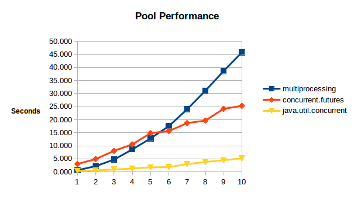

# pools

Experimentation of process pools in Python and thread pools in Java/Scala. In each example the program will create an executor that will spawn as many processes/threads as the number of cores on the host machine. Each worker process/thread will compute the prime factorization of each number starting from 100 to K, where K is the first argument passed through the command line. Sample results below (with K*10^5 on the horizontal axis).



multiprocessing.Pool
```
pools/python$ time python3 multiproc_pool.py 50000
12.723121881484985

real	0m12.893s
user	0m42.522s
sys	    0m0.310s
```

concurrent.futures
```
pools/python$ time python3 futures_pool.py 50000
12.269752025604248

real	0m33.310s
user	1m9.373s
sys	    0m10.066s
```

java.util.concurrent
```
pools/java$ time scala JavaPool 50000
2.132612336

real	0m2.529s
user	0m7.128s
sys	    0m0.391s

```
